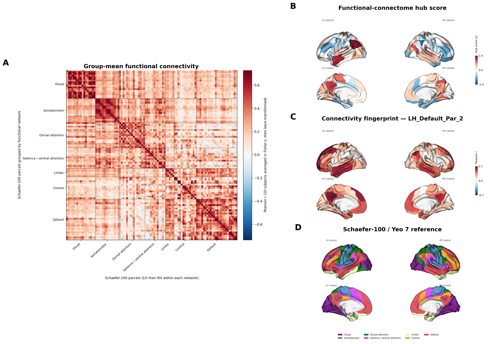

# Results

All 10 functional runs were processed successfully. Each run produced 100 regional time series and a 100 × 100 Pearson-correlation matrix.

The group graph contained 100 nodes and 742 edges at density 0.1499.

## Global metrics

| Metric | Value |
|---|---:|
| Mean degree | 14.840 |
| Mean strength | 7.590 |
| Unweighted clustering | 0.545 |
| Weighted clustering | 0.344 |
| Transitivity | 0.530 |
| Global efficiency | 0.495 |
| Unweighted path length | 2.362 |
| Weighted path length | 4.779 |
| Degree assortativity | 0.114 |
| Weighted modularity | 0.511 |
| Communities | 4 |
| Small-world sigma | 2.527 |

The sigma value exceeded one under the implemented random-reference procedure. This is a descriptive result for this graph definition and small technical sample, not a population-level inference.

## Highest-ranked hub

The highest composite hub score was found in `LH_Default_Par_2`, corresponding to parcel 41 in the validated Schaefer-100 fsLR32k ordering.

Complete node metrics are available in `results/tables/table5_group_node_metrics.tsv` and the top ten hubs in `results/tables/table6_top_hubs.tsv`.

## Final surface-based figure



The final multipanel figure combines the complete group-mean connectivity matrix, the parcel-wise composite hub score on cortical surfaces, the connectivity fingerprint of `LH_Default_Par_2`, and the Schaefer-100 / Yeo-7 reference.

## Native CIFTI outputs

Native Connectome Workbench outputs are available under `results/cifti/`.

Validation includes the 100 × 100 `pconn`, parcel axes matching the Schaefer matrix labels, parcel 41 corresponding to `LH_Default_Par_2`, and dense hub/fingerprint values matching the validated parcel-level results within floating-point precision.

Validation metadata are stored in `results/cifti/workbench_cifti_validation.json`.

## Interactive Workbench scene

A portable scene is provided at:

`results/workbench/connectome_surface_pconn_LH_Default_Par_2.scene`

The scene restores four Conte69 cortical views together with the full 100 × 100 connectivity matrix and parcel 41 (`LH_Default_Par_2`) as the active map.

Rebuild the viewer with:

```bash
export PYTHON_BIN="$HOME/.venvs/connectome-surface/bin/python"
scripts/12_prepare_workbench_viewer.sh /path/to/workbench_viewer
/path/to/workbench_viewer/01_open_scene.sh
```

## Interpretation boundaries

This is a reproducible technical connectomics demonstration based on 10 already-preprocessed resting-state fMRI datasets. It does not provide population-level statistical inference, diagnostic interpretation, replication of upstream preprocessing, or an independent numerical BRAPH replication.
