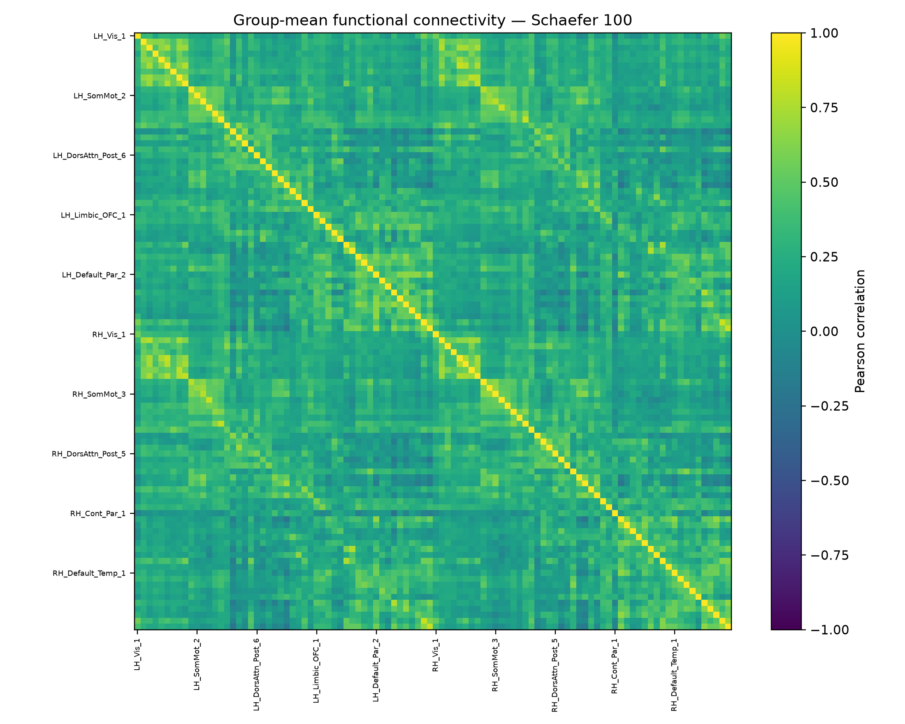
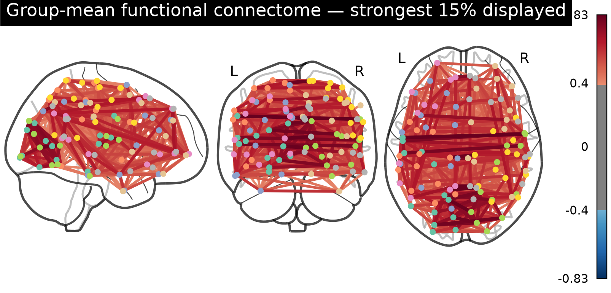
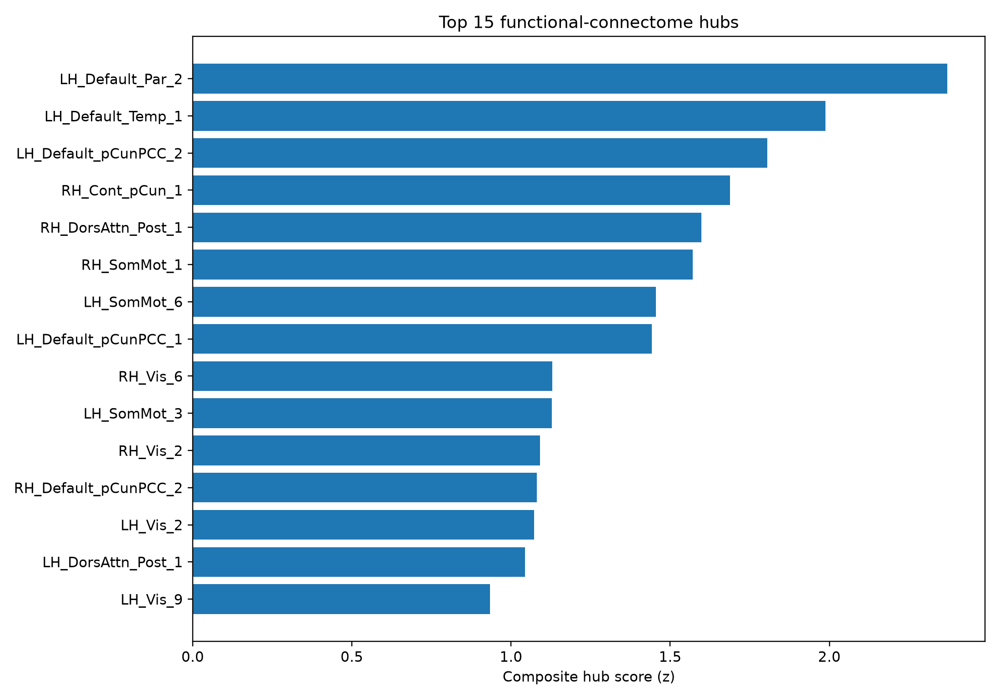

# Results

All 10 functional runs were processed successfully. Each run produced 100 regional time series and a 100 × 100 Pearson-correlation matrix.

The group graph contained 100 nodes and 742 edges at density 0.1499.

## Global metrics

| Metric | Value |
|---|---:|
| Mean degree | 14.840 |
| Mean strength | 7.590 |
| Unweighted clustering | 0.545 |
| Weighted clustering | 0.344 |
| Transitivity | 0.530 |
| Global efficiency | 0.495 |
| Unweighted path length | 2.362 |
| Weighted path length | 4.779 |
| Degree assortativity | 0.114 |
| Weighted modularity | 0.511 |
| Communities | 4 |
| Small-world sigma | 2.527 |

The sigma value exceeded one under the implemented random-reference procedure. This is a descriptive result for this graph definition and small sample.

## Hubs

The highest composite hub score was found in `LH_Default_Par_2`. Default-network parcels occupied three of the first four ranks, with control, dorsal-attention, somatomotor, and visual parcels also represented.

Complete node metrics are available in `results/tables/table5_group_node_metrics.tsv` and the top ten hubs in `results/tables/table6_top_hubs.tsv`.
